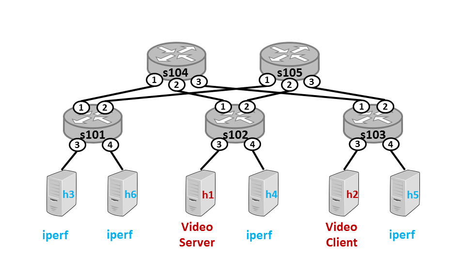
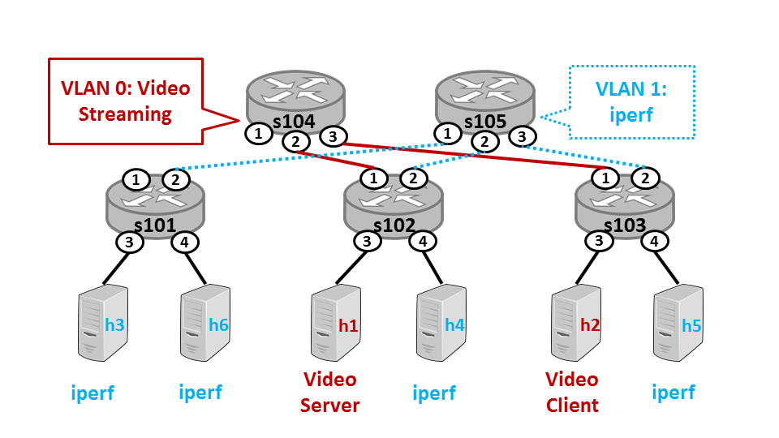
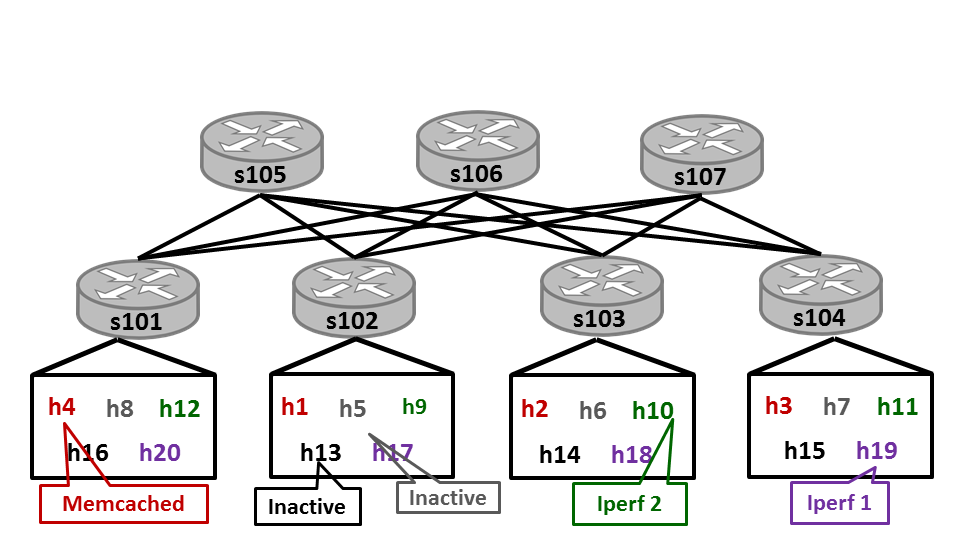

# cloudnetmooc
			
In this project, Coursera has provided a sample project on a Virtual Machine containing the network emulator for our miniature data center. This assignment is part of the Cloud Networking course. 
While completing the assignments, we observe the impact of routing policies on application performance.

Resources:
-	Mininet Network Emulator to run a Software Defined Network
https://github.com/mininet/mininet/wiki/Introduction-to-Mininet
-	Ryu controller to control the SDN
-	All set up was already done in the VM

1)	 In the first assignment, we add code to the file ~/cloudnetmooc/minidc/controller/bwmon.py. This file contains the code to issue a port statistics request to each switch in the network. Each switch responds asynchronously with a packet containing the statistics for each of its ports. Each port is connected to a device on the network, such as a host or another network.
We use the following topology 

 
2)	In the previous assignment we learned how much each host contributes to the amount of congestion in the network. Now, we improve the routing policy to provide better isolation between the tenants.
In Assignments 1 and 2, the routing policy sent all traffic from edge switches through one core switch. We improve the policy by distributing the traffic from edge switches across all core switches. Each core switch will have a set of one or more tenants assigned to it. Edge switches will then route traffic to the appropriate core switch based on the tenant association of the source and destination.
We use the same topology as before

We add code to the file ~/cloudnetmooc/minidc/controller/policy.py. Specifically, you will extend the function build() in the class StaticRouting. The code installs a rule in each edge switch. If the destination host is a neighbor – that is, if the host is directly connected to the switch via a port – output the packet out that port. If not, send the packet "up" to the core switch that is associated with the destination host's VLAN. 
We see improvement in the video streaming application after changing the Policy to Static Routing Policy 
3)	While the routing policy in the previous assignment utilizes all core switches, statically assigning core switches to route traffic for each VLAN can be problematic. Not all tenants use the same amount of bandwidth, so the load on the core switches may not be evenly distributed. As a result, one core switch may handle traffic for many tenants using large amounts of bandwidth while the other core switches are under utilized. In this assignment, we will observe this scenario and update our routing policy to account for different traffic demands between tenants.
We use a larger topology for this assignment.
 

Rather than pre-assigning VLANs to particular core switches, the new adaptive routing policy will create a flow scheduling policy that balances flows across core switches, regardless of their VLAN/tenant association.We implement this improved policy in the file ~/cloudmooc/minidc/controller/policy.py. Specifically, we add code to the function minUtilization() in the class AdaptivePolicy. Our code uses the dictionary self.utilization to find the least utilized core switch. This dictionary stores switch names as keys and utilization (in bytes) as the value.
